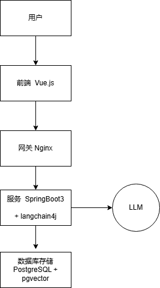
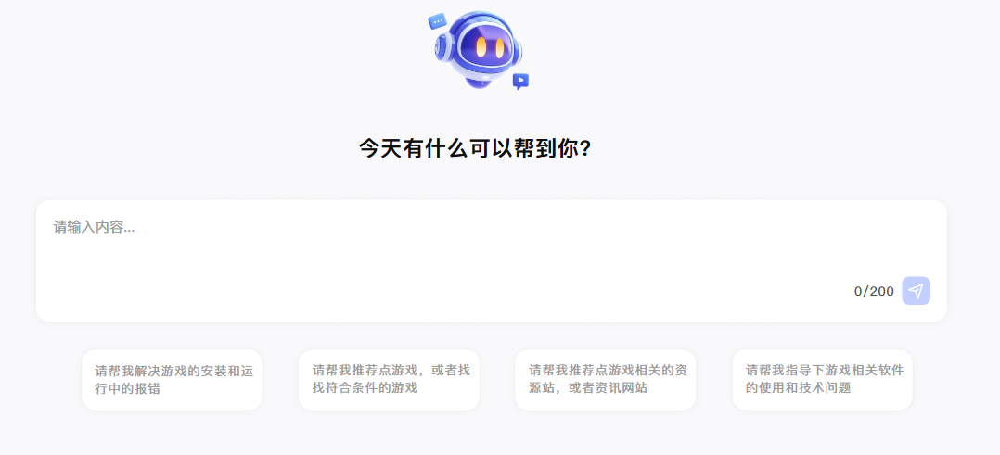
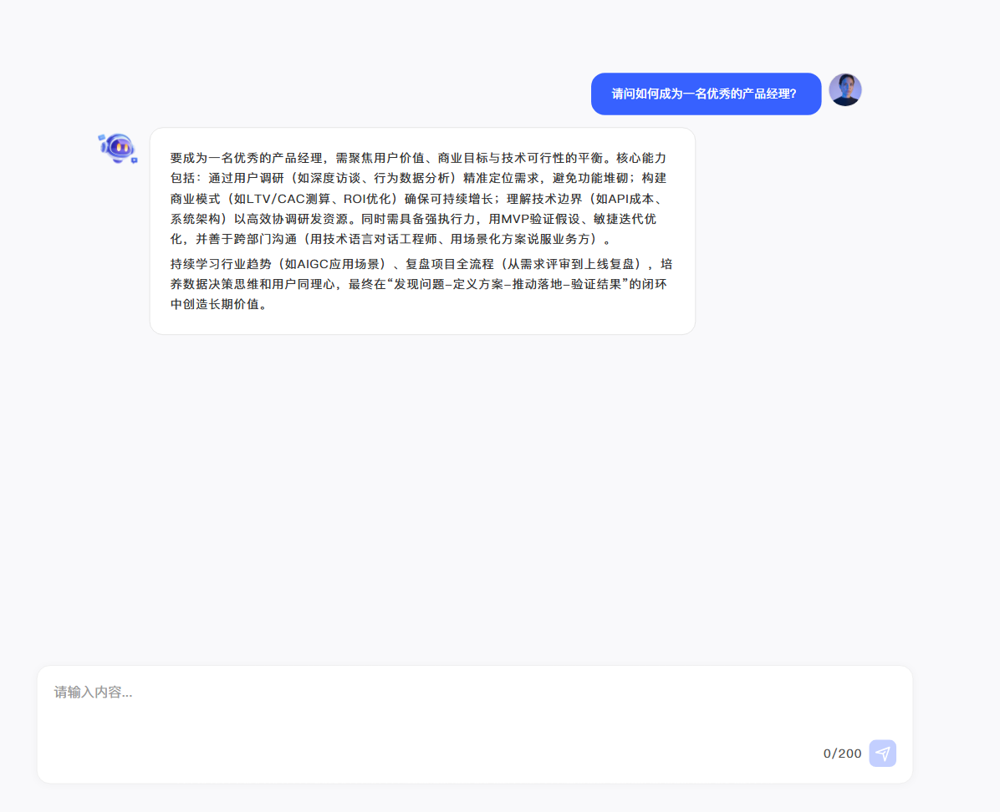

开发的是一个AI对话网页，专注于通过AI的对话，帮助用户解决gal相关的求助

包括4大方面：  
	1、游戏的资源下载网站和资讯的获取，
	2、游戏的推荐和评价(标签、剧情相关) ，
	3、游戏安装和运行报错的解决，
	4、游戏软件技术相关问题和探讨。

## 一、 项目背景概述 (Project Background)

### 1.1 行业现状与痛点

Galgame（美少女游戏）受众群体庞大且粘性极高，但用户在享受游戏过程中面临碎片化的信息困境：

- **信息差巨大：** 资源分布在各类论坛、网盘和频道中，新手获取门槛高，容易遭遇虚假资源或病毒。
- **技术门槛高：** 由于系统环境、转区工具（LE/NT）、运行库缺失等问题，新手安装游戏时报错率高，传统发贴和查贴效率低下。
- **作品匹配难：** 每年产出大量作品，用户要找一部自己想要的作品需要在不同平台和真人跨时间的对话，需要更具深度的对话式推荐。
- **技术交流断层：** 引擎解包、汉化技术等硬核内容散落在各大社区，缺乏系统性的智能化检索。

### 1.2 产品定义

本项目旨在打造一个**垂直于 Galgame 领域的 AI 驱动型对话平台**。它不仅是一个聊天机器人，而是一个集成了**私有知识库 (RAG)** 的智能化专家系统，为用户提供从“资源获取”到“安装运行”再到“深度鉴赏”的全生命周期支持。

## 二、 项目可行性分析 (Feasibility Analysis)

### 2.1 技术可行性 (Technical Feasibility)

- **大语言模型 (LLM) 基础：** 现有的 LLM（如 GPT-4, Claude, DeepSeek 等）已具备极强的文本理解和逻辑推理能力，足以处理复杂的剧情分析和代码纠错。
- **RAG 检索增强技术：** 通过 **向量数据库 (Vector DB)** 存储最新的游戏资讯、报错案例和汉化文档，可以有效解决 AI 的“幻觉”问题，确保资源链接和报错解决方案的准确性。
- **多模态识别：** 现有的视觉模型可以辅助识别用户上传的系统报错截图，实现“看图识错”，极大提升解决问题的效率。

### 2.2 市场与需求可行性 (Market & Demand Feasibility)

- **刚需属性：** 报错解决和资源获取是 Galgame 玩家的“头号天敌”，属于生态的刚需。
- **圈层文化：** 垂直领域的 AI 助手更容易建立用户信任感，相比泛化 AI（如 ChatGPT），它能理解“推土机”、“白学”、“十二魔器”等圈内术语，用户粘性强。
- **内容壁垒：** 随着知识库的不断累积，该平台将形成极强的护城河，成为圈内必备的工具型入口？。

### 2.3 运营与合规可行性 (Operational & Compliance)

- **资源合规性：** *风险提示：* 项目应定位为“导航与资讯获取”，而非直接存储非法资源。通过引导用户至正版平台或提供合法的资源搜索方法，降低法律风险。
- **社区支持：** 可以通过与汉化组、资源组合作，获取权威的技术支持和资讯更新，形成互利共赢的生态。

### 2.4 可行性总结 (SWOT 分析)

| **优势 (Strengths)**                              | **劣势 (Weaknesses)**                                  |
| ------------------------------------------------- | ------------------------------------------------------ |
| 垂直领域专业性强；AI 交互体验优于传统论坛。       | 知识库初期整理工作量大；API 调用成本高。                 |
| **机会 (Opportunities)**                          | **威胁 (Threats)**                                     |
| 二次元文化持续出圈；AI 技术快速迭代降低开发门槛。 | 版权政策收紧；大型通用 AI 可能在未来增强垂直领域能力。 |

## 三、 系统目标 (System Objectives)

- **构建一站式生态入口：** 打造一个打破信息孤岛的平台，让用户无需在多个论坛、网盘、Q群之间切换，通过单一对话窗口解决所有关于 Galgame 的需求。
- **降低入坑门槛：** 通过 AI 的自动化引导，将新手玩家从繁琐的“转区、补丁、环境配置”中解脱出来，提升整个 Galgame 圈子的活跃度。

## 四、 开发技术描述 (Technical Description)

### 4.1 开发工具 (Tools)

- **后端开发：** Python 3.10+ + FastAPI
- **前端开发：** VS Code + Node.js 20+ + Vite。
- **数据库管理：** pgAdmin 4 或 DBeaver (用于管理 PostgreSQL 及查看向量数据)。
- **API 调试：** LangChain4j 内置日志或 Postman，用于观察 Prompt 与 LLM 的交互过程。
- **部署运维：** 阿里云 ECS (Ubuntu 22.04 LTS) + Docker & Docker Compose (用于一键拉取 pgvector 镜像及应用部署)。

### 4.2 技术路线 (Technical Roadmap)

| 序号 | 类别              | 技术路线      |
| ---- | ----------------- | ------------- |
| 1    | JavaEE+python     | JDK 17+python3.10+ |
| 2    | 数据库            | PostgreSQL 16 |
| 3    | 应用服务器        | uvicorn(ASGI服务器)  |

### 4.3 技术选型 (Tech Stack Selection)

| **组件维度**       | **具体选型**                 | **理由**                                                                   |
| ------------------ | ---------------------------- | ---------------------------------------------------------------------------|
| **前端框架**       | **Vue 3 (Composition API)**  | 国内生态比较好，资料比较多                                                   |
| **后端框架**       | **fastapi**                  | 高性能异步支持，与 LangChain 完美集成                                        |
| **AI 框架**        | **LangChain**                | Python 生态最好的 LLM 框架，支持 RAG                                        |
| **数据库**         | **PostgreSQL 16 + pgvector** | 避免引入额外的向量数据库（如 Milvus），降低维护成本，支持 SQL 与向量混合查询。 |
| **LLM 模型**       | **DeepSeek Chat**            | 国产模型，理解 Galgame 语境极佳且价格便宜。                                  |
| **Embedding 模型** | **nomic-embed-text**         | 本地运行，支持中文                                                          |
| **服务器**         | **阿里云 ECS (2核4G起)?**    | 运行 Java 应用和 PostgreSQL 容器                                            |

### 4.4 针对 Galgame 场景的特别优化 (PDM 视角 未来)

- **报错图片处理：** 建议后端集成 `Tesseract` 或调用 `GPT-4o` 视觉接口，专门处理日文游戏报错弹窗的 OCR 识别。
- **持久化记忆：** 利用 `PostgresChatMemoryStore`。这意味着当用户下次上线询问“上次那个报错我解决了，接下来该怎么打补丁？”时，AI 能够无缝衔接。
- **流式响应 (Streaming)：** 采用 SSE (Server-Sent Events) 协议，让 AI 回复像 ChatGPT 一样逐字弹出，极大提升用户等待容忍度。

### 4.5 开发环境搭建

暂无

### 4.6 开发环境信息

暂无

## 五、 系统结构

### 5.1 技术架构

### 5.2 应用架构

- 用户请求处理模块

- AI 对话引擎（LangChain Agent）

- 知识库检索模块（RAG）

- 会话管理模块

### 5.3 业务架构

- 资源资讯获取

- 游戏推荐评价

- 报错排查解决

- 技术讨论交流

### 5.4 数据架构

- ai_chat_session_info（会话表）

- ai_message_info（消息表）

- ai_documents（知识库文档表）

- document_embeddings（向量存储表）

### 5.5 网络架构

暂无

## 六、 系统功能设计

### 6.1 用户对话

#### 6.1.1 描述

​	AI对话系统包含有**资讯信息的获取**、游戏的**报错排查**、游戏的**推荐**以及游戏相关的**技术讨论**等等四大块功能。用户可以通过与AI助手对话的方式，自主解决自己的诉求。

#### 6.1.2 用户界面概览

用户首页：

用户会话页：

#### 6.1.3 业务流程图

暂无

#### 6.1.4 数据库表结构

暂无

### 6.2 知识库管理工作台

#### 6.2.1 描述

​	可以管理系统所需的知识库，进行添加/删除某个知识库文件。
​	....等等

#### 6.2.2 管理界面概览

暂无

#### 6.2.3 业务流程图

暂无

#### 6.2.4 数据库表结构

暂无

## 七、 系统非功能设计

### 7.1 性能

暂无

### 7.2 安全

暂无
