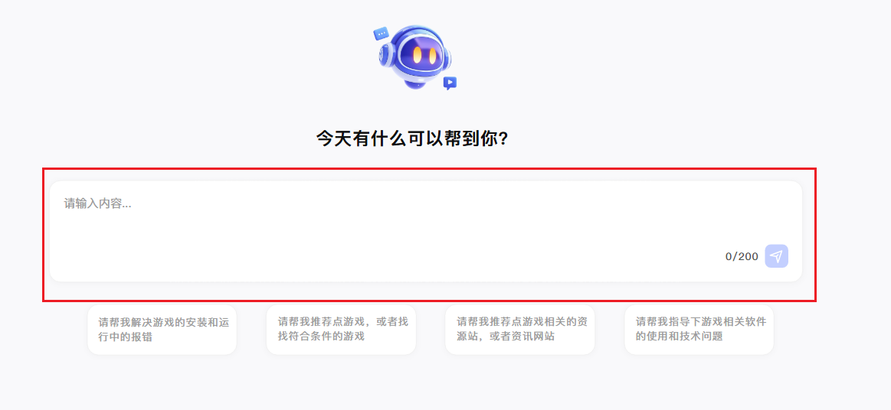
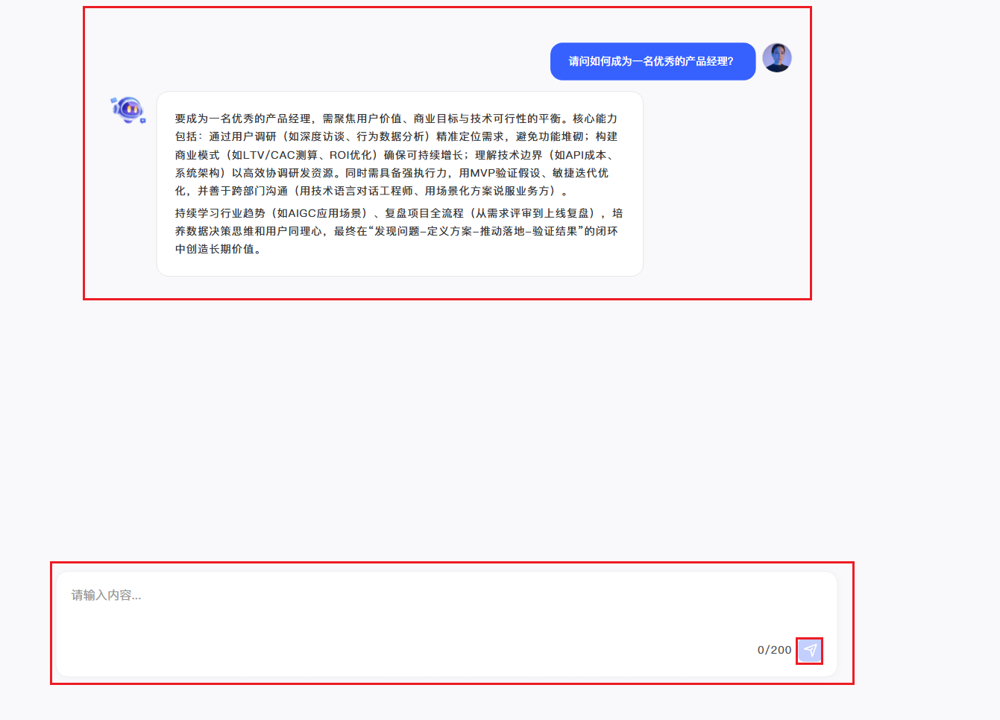

## 一、 需求目标

​	实现AI助手的首页（包含：logo、对话发送框、以及快捷功能对话按钮）；

​	实现AI助手的对话，实现用户与AI的对话功能；

## 二、功能性需求

### 2.1 首页需求

#### 2.1.1 对话发送框

##### 需求描述

**路径：**

​	首页

**权限：**

* **发起对话功能**

  用户可以通过在对话框中输入对话内容发起对话

**使用用户：**

​	全部用户

##### 业务场景和业务流程

**业务场景：**用户手动输入内容发起对话

**业务流程：**

#### 2.1.2 快捷功能对话按钮

##### 需求描述

**路径：**

​	首页

**权限：**

* **发起特定功能对话**

  用户可以通过快捷矩形按钮，直接开启某个特定功能的对话

**使用用户：**

​	全部用户

##### 业务场景和业务流程

**业务场景：**用户有很具体的需求，可以快捷进入正题

**业务流程：**

### 2.2 对话需求

##### 需求描述

**路径：**

​	对话页

**权限：**

* **持续对话**

  用户可以通过对话框，与AI助手持续地进行对话，直到用户问题的解决

**使用用户：**

​	全部用户

##### 业务场景和业务流程

**业务场景：**用户手动输入内容持续对话解决问题

**业务流程：**